  
  
  

## 🦉 About me

- 🔭 Building **[Gamblora](https://gamblora.com)**, a bilingual casino hub with live promo codes, ratings and reviews
- 🤖 I automate everything I touch: bots, parsers, pipelines
- 🔒 Most of my work lives in private repos
- 🌙 Most productive between midnight and sunrise, hence the owl

## 🛠️ Tech stack

  

## 🚀 Featured

## 📈 Activity

  

<picture>
  <source media="(prefers-color-scheme: dark)" srcset="https://raw.githubusercontent.com/sova80412-dotcom/sova80412-dotcom/output/snake-dark.svg" />
  <source media="(prefers-color-scheme: light)" srcset="https://raw.githubusercontent.com/sova80412-dotcom/sova80412-dotcom/output/snake.svg" />
  
</picture>

